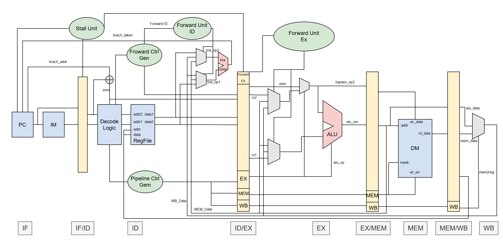
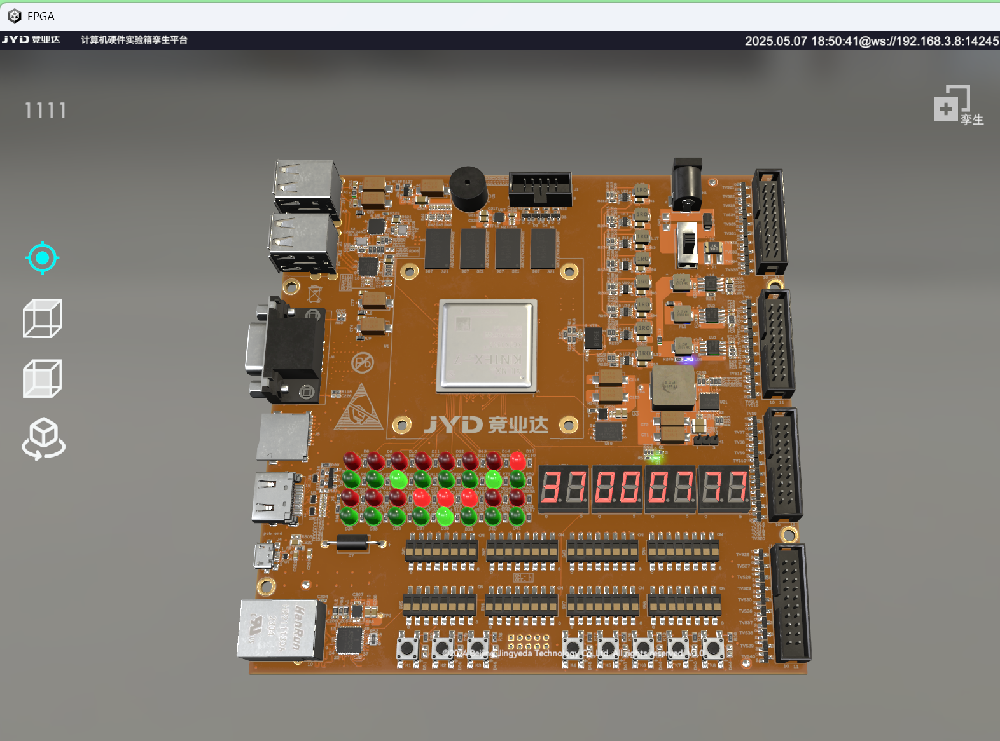
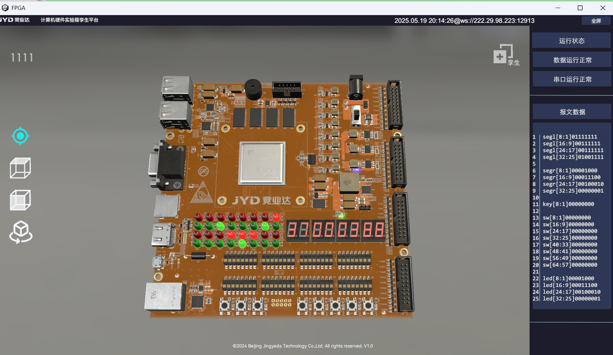
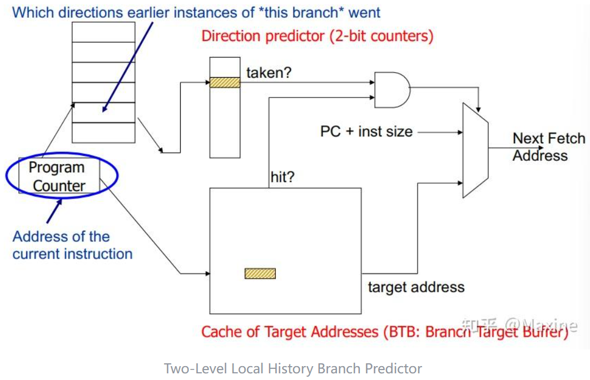
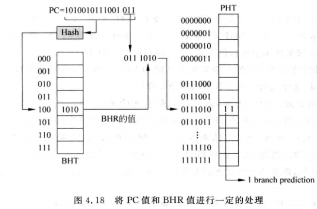

# RISC-V CPU Design Project
## Brief Intro.
This Project is a 5-stage pipelined RV32I CPU implemented in SystemVerilog HDL.

The project is targeted at The 9th China College IC Competition-The JYD Trophy's preliminary contest(第九届集创赛-竞业达杯初赛).

Our team ID is CICC0901516.  
Our team name is 三个小学生.  
Our team members are 华雪峰, 邱伟博, 张灏桐.

## Overview
The block diagram of our CPU design is as below: 



With these features:
- 5-stage(IF-ID-EX-MEM-WB) pipelined deisgn
- Handle data hazzard, structural hazzard, control hazzard problems properly using data forwarding and stall
- Synchronous reset
- Support RV32I subset(except ```ecall, ebreak, fence```)
- Predict untaken branching strategy
## Platform
Design & Simulation: WSL2 Linux Ubuntu 22.04 LTS  
Verification on FPGA: Windows11, FPGA board with Kintex-7 xc7k325tffg900-2 chip
## Dependencies
[Verilator 5.032](https://github.com/verilator/verilator)  
[GTKWave Analyzer v3.3.104](https://gtkwave.sourceforge.net/)  
[GNU Make 4.3](https://www.gnu.org/software/make/)  
[Vivado v2023.2 (64-bit)](https://china.xilinx.com/support/download/index.html/content/xilinx/zh/downloadNav/vivado-design-tools.html)  
[Python3](https://www.python.org/downloads/)

## Structrue
The project's structrue is as below:
```
.
├── README.md
├── RTL/
├── RISCV-Trace/
├── RISCV-Verify/
└── workspace/
```
- Design Source Code
    - RTL: include common srcs and unique srcs used in simulation & verification.
- Simulation
    - workspace: Include all design srcs and **self-defined testcases**.  
    - RISCV-Trace: Include **cdp-tests testcases** and modified srcs for ```miniRV_SoC.sv```.
- Verification(on FPGA board)
    - RISCV-Verify: Include **on-board vivado project** and **testcase provided by preliminary contest**(```dram.coe, irom.coe```).

## Design Source Code
See ```readme``` in ```RTL/``` for details.

## Simulation & Tests
### 1.RISCV-Trace (cdp-tests)
#### Structure
```
./
├── Makefile
├── asm/
├── bin/
├── csrc/
├── golden_model/
├── meminit.bin -> bin/add.bin
├── mySoC/          # all design srcs are added here
├── run_all_tests.py
├── start.dump
└── vsrc/
```
Except modification for ```mySoC/``` to implement our CPU deisgn, other content is the same as [cdp-tests](https://gitee.com/hitsz-cslab/cdp-tests).
#### Usage
**1.Enter the directory**
```bash
cd RISCV-Trace
```
**2.Test single case**  
You can run single test choosing from **{add, addi, and, andi, ...}**. See testcase names in ```bin/``` for details.  
For example, the below command will test ```add.bin```:
```bash
make run TEST=add
```

**3.Test all cases**  
Run the commands below to start all 39 testcases simulation.
```bash
make build    # make sure build once before run all tests
python3 run_all_tests.py
```

(Optional) After running any case, watch wave using gtkwave, e.g. ```gtkwave waveform/add.vcd```


### 2.workspace (self-defined tests)
#### Structure
```
./
├── Makefile
├── data_gen/       # IMEM/DMEM data gen scripts
├── readme.md
├── sim_results/
├── sim_wrappers/   # verilator wrappers
├── top.tcl         # trace tcl used for monitoring
├── vsrcs/          # CPU design .sv codes
└── wave_dir/
```

#### Usage
**1.Enter the directory**  
```bash
cd workspace
```

**2.Create memory dump files**
```bash
touch inst_memory.txt
touch data_memory.txt
```

(Optional) Add self-defined instructions stored in IMEM as needed(see ```data_gen/inst_memory_gen.cpp```), you may need modify the memory config in ```vsrcs/defines.sv``` for instruction set larger than default(16x32bit)

(Optinal) Add self-defined data stored in DMEM as needed(see ```data_gen/data_memory_gen.cpp```), you may need modify the memory config in ```vsrcs/defines.sv``` for data size larger than default(32x32bit)

**3.Generate inst_memory/data_memory data and Run CPU simulation**  
The make options set 'true' will write insts in ```data_gen_inst_memory.cpp``` and data in ```data_gen_data_memory.cpp``` into dump files before simulation.
```bash
make top IMEM_GEN_ENABLE=true DMEM_GEN_ENABLE=true
```

If you have written inst_memory/data_memory once and don't want to write again, just run 
```bash
make top
```
to start CPU simulation only.

**4.Watch simulation results**  
If no error occurs, you can watch waveform by
```bash
make wave
```
This will open simulation wave using gtkwave and display waves set by ```top.tcl```.  
(Optional) Modify ```top.tcl``` to watch waves as needed.

## Verification on FPGA
Use contest template project in```JYD2025_Contest-Template``` provided by the contest, which contains **RV32I tests** and a **Performance test**.  

The complete vivado project is ```verification``` in our handin directory.

**1.Open the project**  
Run vivado 2023.2 -> click 'Open project' -> choose ```digital_twin.xpr``` in the template project directory  

**2.Add design srcs to template**  
Click 'Project Manager-Add sources-Add or create design sources' and select all .sv files in ```RISCV-Verify/srcs/design_srcs```.  

(Optional) Modify the config of IP cores as needed, e.g. PLL, IROM, DRAM.  

**3.Synthesis & Implementation**   
Click 'run synthesis' and wait until finished.  
Click 'run implementation' and wait until finished.  

**4.Generate bitstream**  
Click 'generate bitstream' and wait until finished.  

**5.Open Hardware Manager and connect to the FPGA board (remotely)**  
We connect the FPGA board remotely and use the *digital_twin* platform provided by the contest.  

**6.Program Device and Watch the result**
Under the default 50MHz CPU clock generated by PLL, we've passed ISA test and Performance test (see ```RISCV-Verify/irom.asm```).



By raising the CPU clock generated by PLL, we can achieve better performace, e.g. when CPU clock is 100MHz:



## 6.19 Update
We have implemented a **Two-level local history branch predictor based on 2-bit saturation counters**, which mainly comprises with BTB(Branch Target Buffer), BHT(Branch History Table) and LPHT(Local Pattern History Table). See ```RTL/Common/bpd.sv``` for details.





After implementing the branch predictor, the verification result is optimized to 332ms under 100MHz clock, achieving 14% speedup.

>Last updated: 2025.6.19